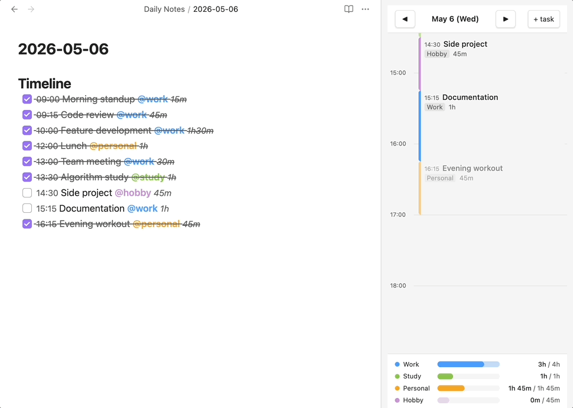
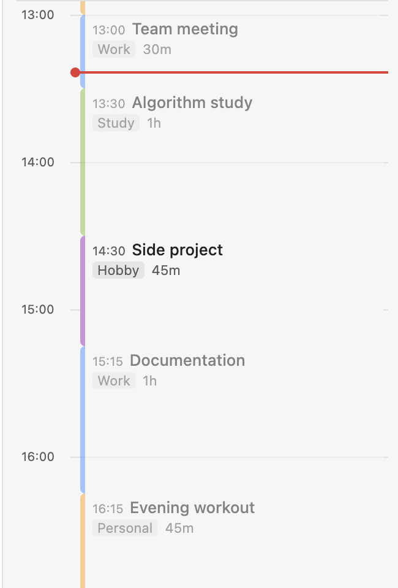
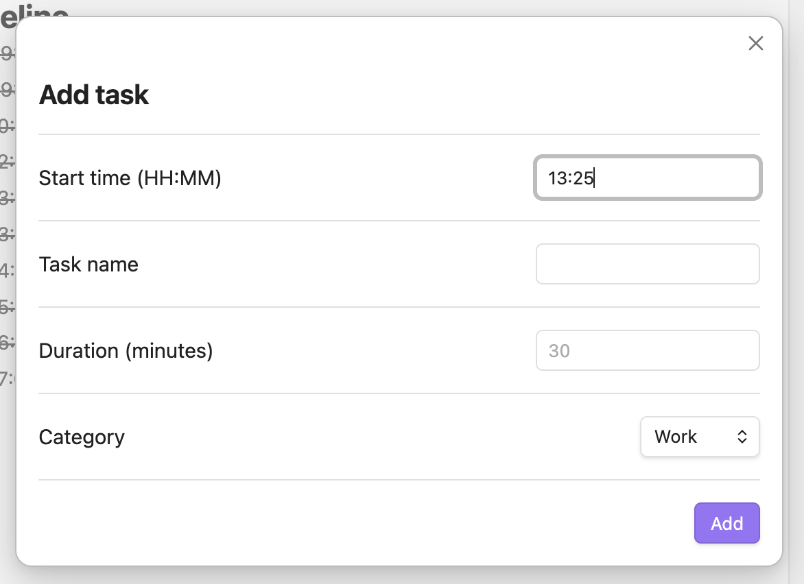
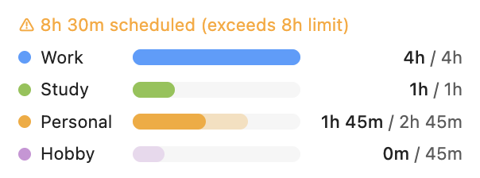
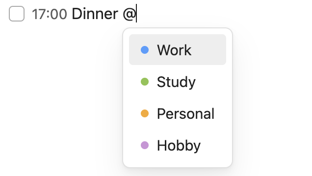

# Time Manager

**[English](README.md)** · [한국어](README.ko.md)

Visualize your Daily Note tasks as a timeline and track time spent by category — all inside Obsidian's sidebar.



---

## Installation

1. Open **Settings → Community plugins → Browse**
2. Search for **Time Manager** and click **Install**
3. Click **Enable**, then click the 🕐 clock icon in the ribbon

---

## Quick start

Add a `## Timeline` section to today's Daily Note and paste this:

```markdown
## Timeline

- [ ] 09:00 Morning routine @personal 30m
- [ ] 09:30 Deep work @work 2h
- [ ] 12:00 Lunch @personal 1h
- [ ] 13:00 Meetings @work 1h30m
- [ ] 23:00 end
```

The timeline renders instantly on the right. Edit the note and it updates live.

---

## How it works

### Timeline view

Tasks appear as time blocks on a vertical axis. The red line shows the current time.



- Click **◀ / ▶** to navigate between days
- Click a Daily Note in the file explorer to jump to that date
- Click **+ task** to add a task via modal



### Daily stats

A bar chart at the bottom shows scheduled vs. completed time per category.



### Editor highlights

Category tags and durations are highlighted as you type. Type `@` to get autocomplete.



---

## Task format

```
- [ ] HH:MM Task name @category duration
```

| Field | Options | Example |
|-------|---------|---------|
| Status | `[ ]` todo · `[x]` done | `[x]` |
| Time | `HH:MM` | `09:30` |
| Category | `@work` · `@study` · `@personal` · `@hobby` | `@work` |
| Duration | `30m` · `1h` · `1h30m` | `1h30m` |

> Duration is required for the stats to be accurate. If omitted, the gap to the next task is used.

---

## Settings

**Settings → Time Manager**

| Setting | Default | Description |
|---------|---------|-------------|
| Daily Note folder | `Daily Notes` | Folder where your Daily Notes live |
| Section heading | `Timeline` | The `##` heading to parse as the timeline |
| Daily work hour limit | `8h` | Overload warning threshold (4–16h) |

---

## License

MIT License — © 2026 Najeong Kim
