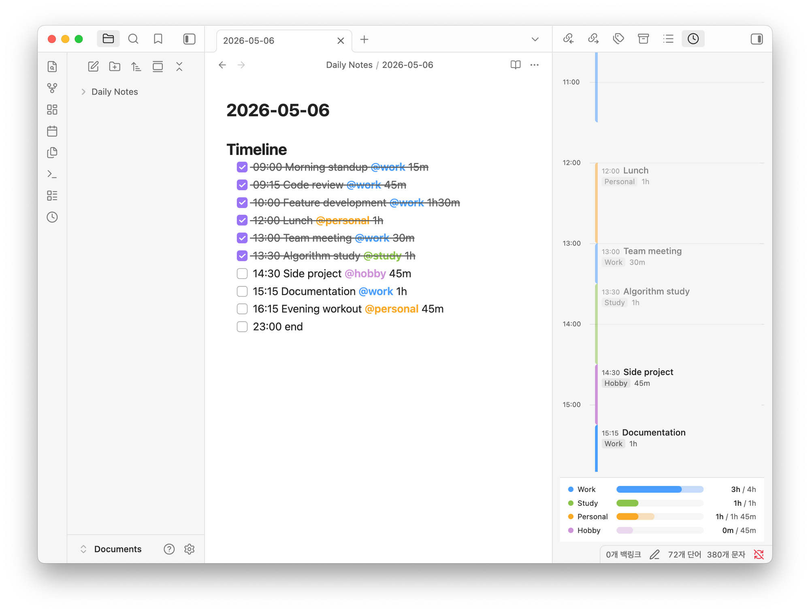

# Time Manager

Visualize your Daily Note tasks as a timeline and track time spent by category — all inside Obsidian's sidebar.



---

## Features

- **Visual timeline** — tasks from your Daily Note rendered as time blocks on a vertical axis
- **Category tracking** — tag tasks with `@work`, `@study`, `@personal`, or `@hobby`
- **Daily stats** — bar chart showing scheduled vs. completed time per category
- **Editor integration** — `@` autocomplete and color highlights while you write
- **Date navigation** — browse any day with `◀` / `▶`, or click a Daily Note to jump to it

---

## Installation

1. Open Obsidian **Settings → Community plugins**
2. Turn off **Restricted mode** if enabled
3. Click **Browse**, search for **Time Manager**, and click **Install**
4. Click **Enable**
5. Click the clock icon in the left ribbon to open the timeline

---

## Usage

Add a `## Timeline` section to any Daily Note and write tasks in this format:

```markdown
## Timeline

- [ ] 09:00 Team standup @work 30m
- [x] 10:00 Feature development @work 2h
- [ ] 13:00 Workout @personal 1h
- [ ] 14:30 Algorithm study @study 1h30m
- [ ] 23:00 end
```

The timeline updates automatically as you edit. Mark a task done by changing `[ ]` to `[x]`.

### Task format

```
- [ ] HH:MM Task name @category duration
```

| Field | Format | Example |
|-------|--------|---------|
| Time | `HH:MM` | `09:00` |
| Category | `@work` · `@study` · `@personal` · `@hobby` | `@work` |
| Duration | `30m` · `1h` · `1h30m` (unit required) | `1h30m` |

### Adding tasks

Click **+ task** at the top of the timeline to open a modal — start time, name, duration, and category are filled in and inserted automatically into the correct position in your note.

---

## Settings

Go to **Settings → Time Manager**.

| Setting | Default | Description |
|---------|---------|-------------|
| Daily Note folder | `Daily Notes` | Folder where your Daily Notes are stored |
| Section heading | `Timeline` | The `##` heading to parse as the timeline |
| Daily work hour limit | `8h` | Shows a warning when scheduled time exceeds this (4–16h) |

---

## License

MIT License — © 2026 Najeong Kim
